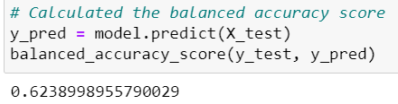

# Credit_Risk_Analysis
## Overview of Project 
### Purpose
The purpose of this project is to build and evaluate SUPERVISED machine learning models to predict credit risk, implement different algorithms and analyze the performance of each one and decide which one is better to predict the credit risk. We use six different models: Cluster Centroids, SMOTEEN, Balanced Random Forest Classifier, Easy Ensemble Classifier, Random Over Sampler, and SMOTE.

## Results 

*Random Over Sampler

In this case, we use the Random Over Sampler to oversample the smaller class of data, first, we observe the accuracy score, which is 62%, is a low score, then we observe the precision is low for the high risk and high for the low risk, recall is similar in both classes with 62% high risk and 63% low risk.

*SMOTE

In this case, also use the oversampling strategy, for the SMOTE model, the balanced accuracy score is 62% is low, and the precision is also low in high risk and high in low risk, recall is 60% in high risk and 65% in low risk.

*Cluster Centroids 

This model is an undersampling strategy that makes smaller the bigger data. First, we observe the balanced accuracy score, which is low at 50%, then we observe the precision is low the high risk and is high the low risk, the recall is also low, with 59% high risk and 42% low risk.

*SMOTEEN

In this case, we combine over and under-sampling to determine the model, we observe the balanced accuracy score is 64%, and the precision is also low the high risk and high the low risk. The recall is a little bit higher than the high risk with 72%, and the low risk continues low at 57%.

*Balanced Random Forest Classifier

In this model we simpler decision tree, we observe the balanced accuracy score, the result is 78% is a good score, then we observe the precision is low high risk and high the low risk, the recall is high in high risk and low in low risk.

*Easy Ensemble Classifier

Another model is the Easy Ensemble Classifier, we observe a high balanced accuracy score that is 93% and also we observe the precision that is a low high risk, high the low risk, then the recall that is high, high risk is 92% and low risk is 93%.

### Summary

The model's performance doesn't change significantly the results, with the ensemble algorithm the score improves, finally, with the Easy ensemble classifier the performance was better with a final score of 93%, and recall of 93%. So, this model is the best option to predict the credit risk. 
